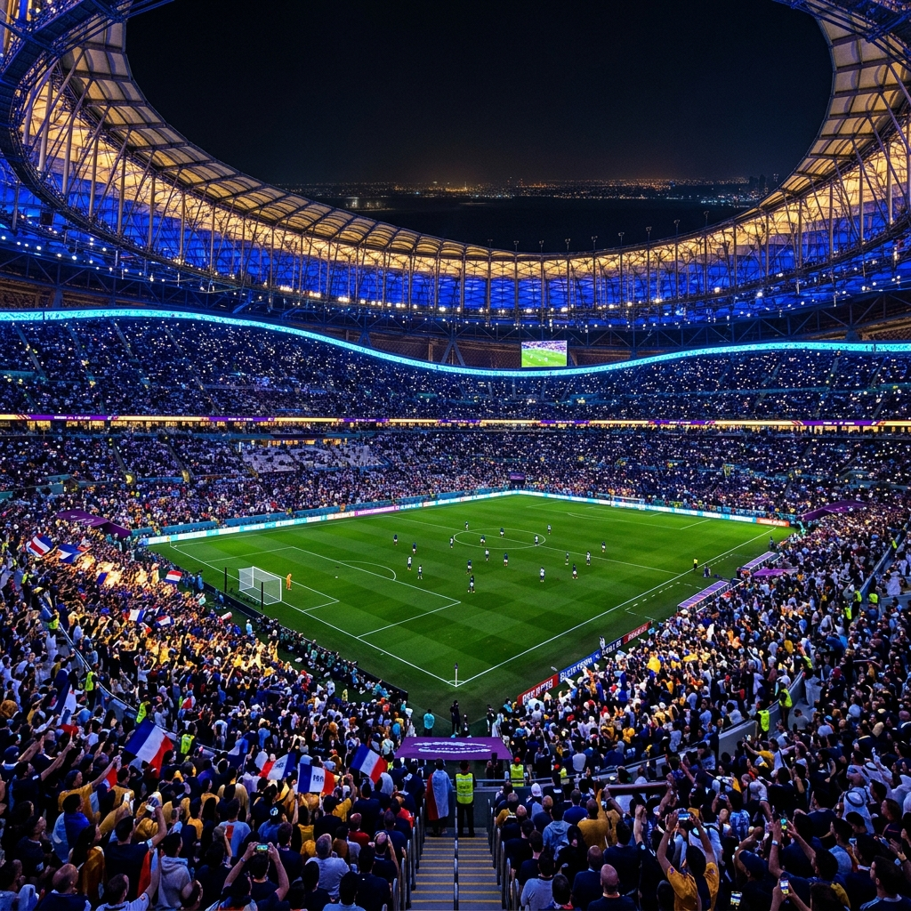

# 🏆 StadiumFlow AI - FIFA World Cup 2026



An AI-powered match journey assistant that helps fans navigate the stadium efficiently while providing organizers with operational intelligence for better crowd management and decision making during the FIFA World Cup 2026.

---

## 📖 Problem Statement Alignment (Virtual: PromptWars)
This project is an official submission for **[Challenge 4] Smart Stadiums & Tournament Operations**.

Managing a crowd of 80,000+ passionate football fans simultaneously is an immense logistical challenge. Traditional navigation and static signage often fail to adapt to live bottlenecks, leading to long wait times, frustrated fans, and overwhelmed stadium staff. 

In strict adherence to the challenge rules, **it is mandatory to use Gen AI**, which is why our solution relies heavily on Generative AI. The goal was to **build a GenAI-enabled solution** that enhances stadium operations and the overall tournament experience for fans and venue staff by leveraging Generative AI for navigation, crowd management, accessibility, and real-time decision support.

---

## 💡 Our Solution: StadiumFlow AI
StadiumFlow AI provides **one unified platform** with intelligent, role-based experiences powered by a live, deterministic crowd simulation engine and advanced Large Language Models (LLMs).

### Features for Fans
* 📍 **Smart Navigation**: Turn-by-turn routing to seats, food, and restrooms, updated live with crowd data to bypass congestion.
* 🤖 **AI Match Assistant**: A contextual, multilingual GenAI assistant. It knows your seat, your gate, and the real-time density of the stadium, providing customized, actionable advice (e.g., "Gate A is busy, use Gate C for a 3-minute wait").
* 🌐 **Multilingual & Accessible**: Native experiences in English, Spanish, Portuguese, and French, with dedicated accessibility support.

### Features for Organizers
* 📊 **Crowd Intelligence**: Real-time density heatmaps and wait times across all gates and concourses.
* 🧠 **Operational AI**: Generates automated, contextual operational summaries (e.g., "Food Court 2 is reaching capacity — recommend opening overflow concession at Section 118").

---

## 🛠️ Technical Architecture

* **Frontend**: React, Vite, TypeScript, Tailwind CSS (v4), Shadcn UI, and Framer Motion.
* **Routing**: TanStack Router for type-safe, seamless navigation.
* **AI Integration**: Groq SDK (Llama-3) seamlessly injected with live JSON simulation state to provide highly contextual LLM responses, complete with robust offline fallbacks.
* **Simulation Engine**: A bespoke, deterministic crowd simulation engine calculating dynamic wait times and zone densities in real-time.

---

## 🚀 Getting Started

1. **Clone the repository:**
   ```bash
   git clone https://github.com/rahoul-samantara/stadiumflow-insight-hub.git
   ```
2. **Install dependencies:**
   ```bash
   npm install
   ```
3. **Set up Environment Variables:**
   Rename `.env.example` to `.env` and add your Groq API Key:
   ```env
   VITE_GROQ_API_KEY=your_groq_api_key_here
   ```
4. **Run the development server:**
   ```bash
   npm run dev
   ```

## 🎨 Design & Accessibility
* Designed with the official **FIFA World Cup Deep Blue and Gold** aesthetics.
* Strict adherence to **WCAG 2.1 AA** contrast standards.
* Fluid, premium micro-animations using Framer Motion.

---
*Built with ❤️ for the 2026 World Cup Hackathon.*
